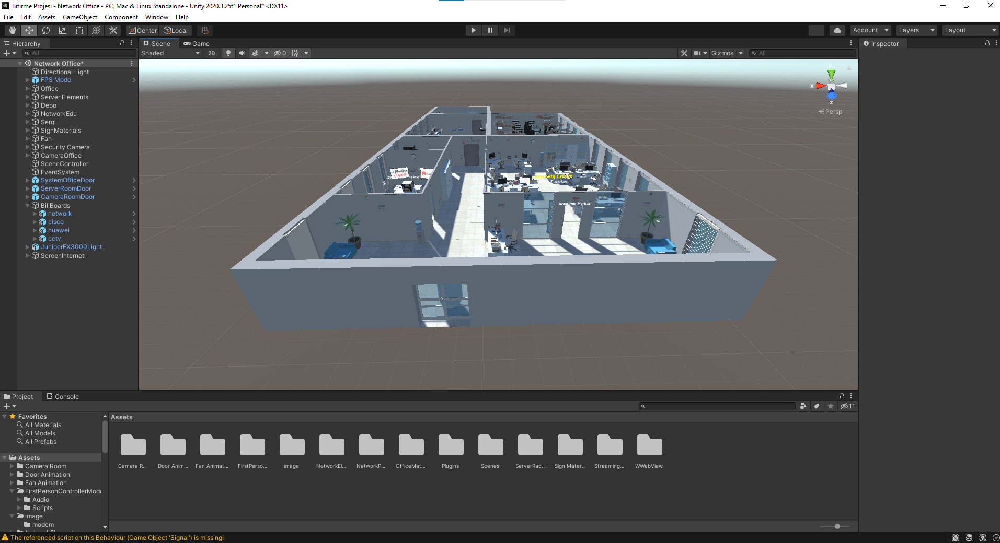
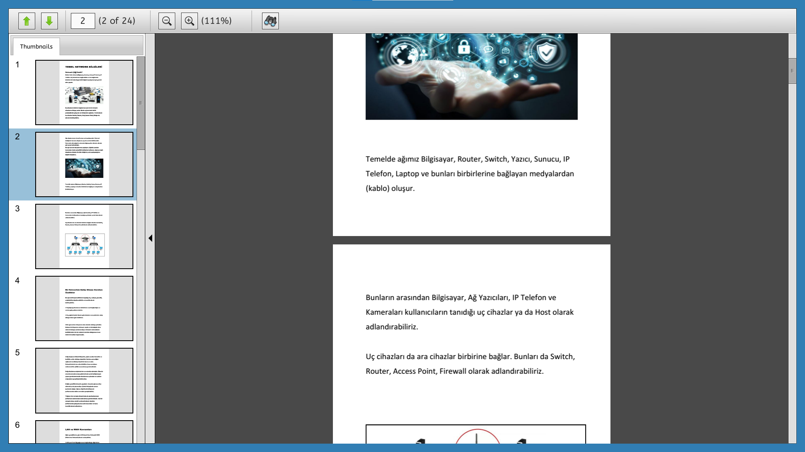

# UNITY - NETWORK OFFICE

Our game has been prepared to learn and practice at the basic level of developing network infrastructures in today's age. You will first find yourself in an office environment. In addition to the office environment, you can find the camera room, system room and data processing office in our game.

## System Room
You can find the server devices used today in the system room in our game. You can return to the main scene by pressing the ESC key.

## Camera Room
There is also a camera room in our game. This camera room is seen as the junction of the office security camera systems. We have an additional automation computer in the camera room. You can get information about CCTV infrastructures by interacting with this automation computer.

## IT Office
Our automation computers also contain important information about network infrastructures in our IT office. On our second automation computer, the commands used in cisco switch and huawei switch settings (config) can be seen. In addition, you can reach the events we have done on network security by interacting with our other automation computer. In our IT office, you can also access the models of network devices used today.

## Network Device Adjustment Room
This room is a place where you can set the switch, which is a network device, using the virtual command interface. We have prepared the most popular commands for you using the virtual interface here, and we have compiled the outputs of the device after the commands are written.

## Research Room
In the research room, it is designed for you to quickly research the topics that you have learned from other offices and are curious about, without leaving the game.

## Camera Access Computer
With the online automation computer, you can access a sample camera platform over the internet.

# Map of the game

# In-Game Images

Contact e-mail for any question: info@sinanozcelik.com

For more: sinanozcelik.com